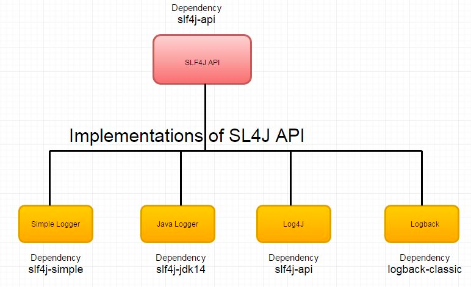

## /java/RadiusChatServerApplication.java

### @SpringBootApplication
Spring Boot @SpringBootApplication annotation is used to mark a configuration class that declares one or more @Bean methods
and also triggers auto-configuration and component scanning. It's same as declaring a class with @Configuration, 
@EnableAutoConfiguration and @ComponentScan annotations.

## /java/configuration/ServerCommandLineRunner.java

### @Component
@Component is an annotation that allows Spring to automatically detect our custom beans. In other words, without 
having to write any explicit code, Spring will: Scan our application for classes annotated with @Component. 
Instantiate them and inject any specified dependencies into them. Inject them wherever needed.

### @Slf4j
The Simple Logging Facade for Java (SLF4J) serves as a simple facade or abstraction for various logging frameworks 
(e.g. java.util.logging, logback, log4j) allowing the end user to plug in the desired logging framework at deployment time.
Thus, it would seem that the SLF4J library provides an abstraction of the underlying logging framework used. 
This, as per their website, would allow you to write applications which are independent of the logging framework 
used since SLF4J wraps over the underlying logging mechanism. Thus, as far as your application would be concerned, 
it won't care what underlying logging mechanism you are using.

### @RequiredArgsConstructor
The @RequiredArgsConstructor annotation generates the constructors with one parameter for each field needing special 
handling. The final fields annotated with @NonNull are the parameters of the required constructor because they need 
special handling. For example, final fields need to be initialized.

## /java/configuration/SocketIOConfiguration.java

### @Configuration
Spring @Configuration annotation is part of the spring core framework. Spring Configuration annotation indicates 
that the class has @Bean definition methods. So Spring container can process the class and generate Spring Beans 
to be used in the application.

### @Bean
Spring @Bean Annotation is applied on a method to specify that it returns a bean to be managed by Spring context. 
Spring Bean annotation is usually declared in Configuration classes methods. In this case, bean methods may 
reference other @Bean methods in the same class by calling them directly.

### @Value
@Value annotation which is used to assign default values to variables and method arguments. We can read spring 
environment variables as well as system variables using @Value annotation. It also supports Spring Expression 
Language (SpEL).

## /java/controller/MessageController.java

### @RestController
RestController is used for making restful web services with the help of the @RestController annotation. 
This annotation is used at the class level and allows the class to handle the requests made by the client. 
The RestController allows to handle all REST APIs such as GET, POST, Delete, and PUT requests. 
Every request handling method of the controller class automatically serializes return objects into HttpResponse.

### [@RestController vs @Controller](https://www.geeksforgeeks.org/difference-between-controller-and-restcontroller-annotation-in-spring/)

### @RequestMapping
One of the most important annotations in spring is the @RequestMapping Annotation which is used to map HTTP requests
to handler methods of MVC and REST controllers. In Spring MVC applications, the DispatcherServlet (Front Controller)
is responsible for routing incoming HTTP requests to handler methods of controllers.

### @CrossOrigin
This @CrossOrigin annotation enables cross-origin resource sharing only for this specific method. By default, its allows
all origins, all headers, and the HTTP methods specified in the @RequestMapping annotation. Also, a maxAge of 30 minutes
is used.

### @GetMapping
The @GetMapping annotation is a composed version of @RequestMapping annotation that acts as a shortcut for 
@RequestMapping(method = RequestMethod. GET) . The @GetMapping annotated methods handle the HTTP GET requests
matched with the given URI expression.

### @PathVariable
The @PathVariable annotation is used to extract the value of the template variables and assign their value to a method variable.

## /java/model/BaseModel.java

### [@Data](https://projectlombok.org/features/Data#:~:text=%40Data%20is%20a%20convenient%20shortcut,beans%3A%20getters%20for%20all%20fields%2C)
@Data is a convenient shortcut annotation that bundles the features of @ToString, @EqualsAndHashCode, @Getter / @Setter 
and @RequiredArgsConstructor together: In other words, @Data generates all the boilerplate that is normally associated 
with simple POJOs (Plain Old Java Objects) and beans: getters for all fields, setters for all non-final fields, and 
appropriate toString, equals and hashCode implementations that involve the fields of the class, and a constructor that 
initializes all final fields, as well as all non-final fields with no initializer that have been marked with @NonNull, 
in order to ensure the field is never null.

### @MappedSuperclass
A mapped superclass is a special type of class that is not persistent itself, but has subclasses that are persistent. 
A mapped superclass is useful for defined a common persistence superclass that defines common behavior across 
a set of classes, such as an id or version attribute.

### @Id
The @Id annotation is inherited from javax.persistence.Id, indicating the member field below is the primary 
key of the current entity.

### [@GeneratedValue](https://www.baeldung.com/hibernate-identifiers)
If we want to automatically generate the primary key value, we can add the @GeneratedValue annotation. 
It provides a specification of strategies for generating primary key values. 
This can use four generation types: AUTO, IDENTITY, SEQUENCE and TABLE. If we don't explicitly specify
a value, the generation type defaults to AUTO.

### [@Column](https://www.geeksforgeeks.org/spring-data-jpa-column-annotation/)
@Column annotation is used for Adding the column the name in the table of a particular MySQL database.

### @CreationTimestamp and @UpdateTimestamp
Hibernate's @CreationTimestamp and @UpdateTimestamp annotations make it easy to track the timestamp
of the creation and last update of an entity. When a new entity gets persisted, Hibernate gets 
the current timestamp from the VM and sets it as the value of the attribute annotated 
with @CreationTimestamp.

## /java/model/Message.java

### @Entity
An entity is a lightweight persistence domain object. Typically, an entity represents a table 
in a relational database, and each entity instance corresponds to a row in that table. 
The primary programming artifact of an entity is the entity class, although entities 
can use helper classes.

### @Builder
The @Builder annotation produces complex builder APIs for your classes. @Builder lets you 
automatically produce the code required to have your class be instantiable with code 
such as: Message.builder()

### @NoArgsConstructor
The @NoArgsConstructor annotation is used to generate the no-argument constructor for a class.

### @AllArgsConstructor
The @AllArgsConstructor annotation generates a constructor with one parameter for every 
field in the class. Fields that are annotated with @NonNull result in null checks 
with the corresponding parameters in the constructor. The annotation won't generate 
a parameter for the static and initialized final fields.

### [@Enumerated](https://www.baeldung.com/jpa-persisting-enums-in-jpa)
The most common option to map an enum value to and from its database representation 
in JPA before 2.1 is to use the @Enumerated annotation. This way, we can instruct
a JPA provider to convert an enum to its ordinal or String value.

## /java/repository/MessageRepository.java

### @Repository
Spring @Repository annotation is used to indicate that the class provides 
the mechanism for storage, retrieval, search, update and delete operation 
on objects.

## /java/service/MessageService.java

### [@Service](https://www.geeksforgeeks.org/spring-service-annotation-with-example/)
In an application, the business logic resides within the service layer so we use the @Service Annotation
to indicate that a class belongs to that layer. It is also a specialization of @Component Annotation 
like the @Repository Annotation. One most important thing about the @Service Annotation is it can be
applied only to classes. It is used to mark the class as a service provider. So overall @Service 
annotation is used with classes that provide some business functionalities. Spring context will 
autodetect these classes when annotation-based configuration and classpath scanning is used.